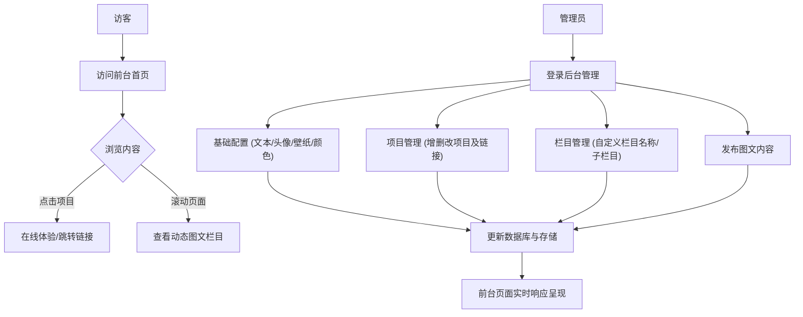

## 1. 产品概述
这是一个高度可定制的个人主页系统，包含前台展示系统与后台管理系统。
- **主要目标**：为用户提供一个极具设计感的个人作品集与博客展示平台，支持完全自定义的界面风格与内容排版。
- **核心价值**：通过可视化的后台管理，用户无需修改代码即可动态调整首页的文本、头像、主题色、Hero区壁纸（含动态图），并能灵活管理项目展示与图文栏目。系统专为 Vercel 平台部署优化，提供极致的加载性能与现代化的交互体验。

## 2. 核心功能

### 2.1 用户角色
| 角色 | 注册/登录方式 | 核心权限 |
|------|---------------------|------------------|
| 普通访客 | 无需登录 | 浏览前台首页内容、体验项目、阅读图文 |
| 管理员 | 账号密码登录 (或 NextAuth 预设管理账号) | 访问后台管理系统，进行全局配置、栏目管理、内容发布 |

### 2.2 功能模块
1. **前台首页**：Hero展示区、项目展示橱窗、动态图文栏目区。
2. **后台管理 - 基础配置**：全局主题色修改、文本/头像替换、Hero区壁纸上传（支持图片/GIF）。
3. **后台管理 - 项目管理**：项目信息的增删改查、封面图上传、体验链接配置。
4. **后台管理 - 栏目管理**：动态栏目的创建/删除、子栏目管理、图文内容的富文本编辑与发布。

### 2.3 页面详情
| 页面名称 | 模块名称 | 功能描述 |
|-----------|-------------|---------------------|
| 前台首页 | Hero展示区 | 沉浸式全屏或半屏展示，包含用户头像、欢迎语、打字机效果文本及动态背景壁纸。 |
| 前台首页 | 项目展示区 | 卡片式展示个人小项目，支持点击在线体验或跳转至外部链接。 |
| 前台首页 | 动态栏目区 | 对应后台设置的栏目1、栏目2等，瀑布流或网格形式展示后台发布的图文内容。 |
| 后台管理 | 登录页 | 管理员身份验证。 |
| 后台管理 | 外观与基础设置 | 提供调色板选择主题色，上传头像与背景图，修改全局文本配置。 |
| 后台管理 | 项目配置页 | 列表管理项目，支持拖拽排序，编辑项目名称、描述、封面与跳转链接。 |
| 后台管理 | 栏目与内容管理 | 树形结构管理栏目与子栏目，内置富文本编辑器发布具体图文内容。 |

## 3. 核心流程
1. **访客浏览流程**：进入首页 -> 浏览 Hero 区信息 -> 滚动查看项目橱窗 -> 点击项目链接进行在线体验 -> 浏览自定义图文栏目内容。
2. **管理员内容更新流程**：进入 `/admin` 登录 -> 在“外观设置”更改主题色和壁纸 -> 在“项目管理”添加新开发的小项目及链接 -> 在“栏目管理”新建子栏目并发布图文 -> 保存后前台通过 SSR/ISR 实时拉取最新数据并展示。

## 4. 界面设计设计 (User Interface Design)

### 4.1 设计风格
- **美学基调**：极简主义（Minimalism）与现代作品集风格结合，大面积留白，通过排版建立视觉层级。拒绝平庸的模板感。
- **色彩与主题**：
  - 支持后台动态注入 CSS 变量以改变全局 `primary-color`。
  - 默认提供优雅的高对比度黑白模式（深色模式优先），辅以用户自定义的高亮强调色。
- **排版字体**：
  - 标题字体：使用具有视觉张力的无衬线展示字体（如 Clash Display 或类似风格）。
  - 正文字体：清晰易读的现代无衬线体（如 Inter 或本地系统字体）。
- **组件样式**：
  - 前台：大圆角或直角（可配置），无边框，轻量级阴影，毛玻璃质感（Glassmorphism）导航栏。
  - 后台：专业、高效的中后台布局（侧边栏+主内容区），采用 shadcn/ui 的极简风格。
- **动画与微交互**：
  - 页面加载时的丝滑元素揭示（Staggered Fade Up）。
  - 项目卡片悬浮时的轻微缩放与发光效果。
  - 平滑的锚点滚动与路由切换动画。

### 4.2 页面设计概览
| 页面名称 | 模块名称 | UI 元素及排版建议 |
|-----------|-------------|-------------|
| 前台首页 | Hero区 | 全屏视口高度，背景支持图片或动态 GIF，前景使用毛玻璃遮罩层保证文字可读性，居中大号排版。 |
| 前台首页 | 项目展示 | 响应式 CSS Grid (PC端3列，平板2列，手机1列)，图片悬浮放大，标题渐变显示。 |
| 前台首页 | 图文栏目 | 杂志化排版，交替式图文布局（左图右文/右图左文），大字号引言。 |
| 后台管理 | 仪表盘 | 左侧深色/浅色侧边栏导航，右侧为主操作区。表单采用分步或卡片式归类。 |

### 4.3 响应式设计
- **Desktop-first**：桌面端优先设计出震撼的宽屏视觉效果。
- **Mobile-adaptive**：移动端自动折叠导航栏为汉堡菜单，项目网格转换为单列滑动，确保图片比例在小屏上完美适配。
- **Touch优化**：移动端增加卡片的防误触间距，优化图文滑动体验。