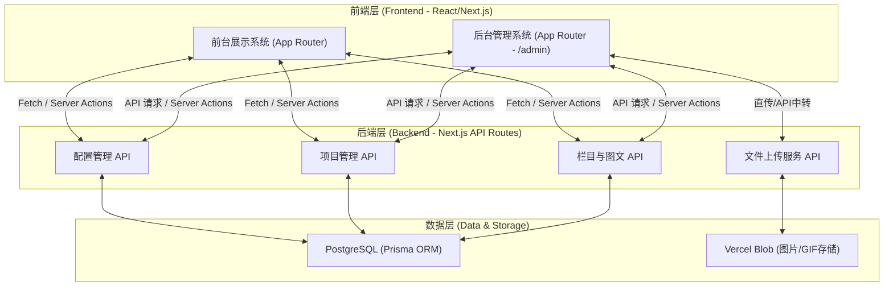
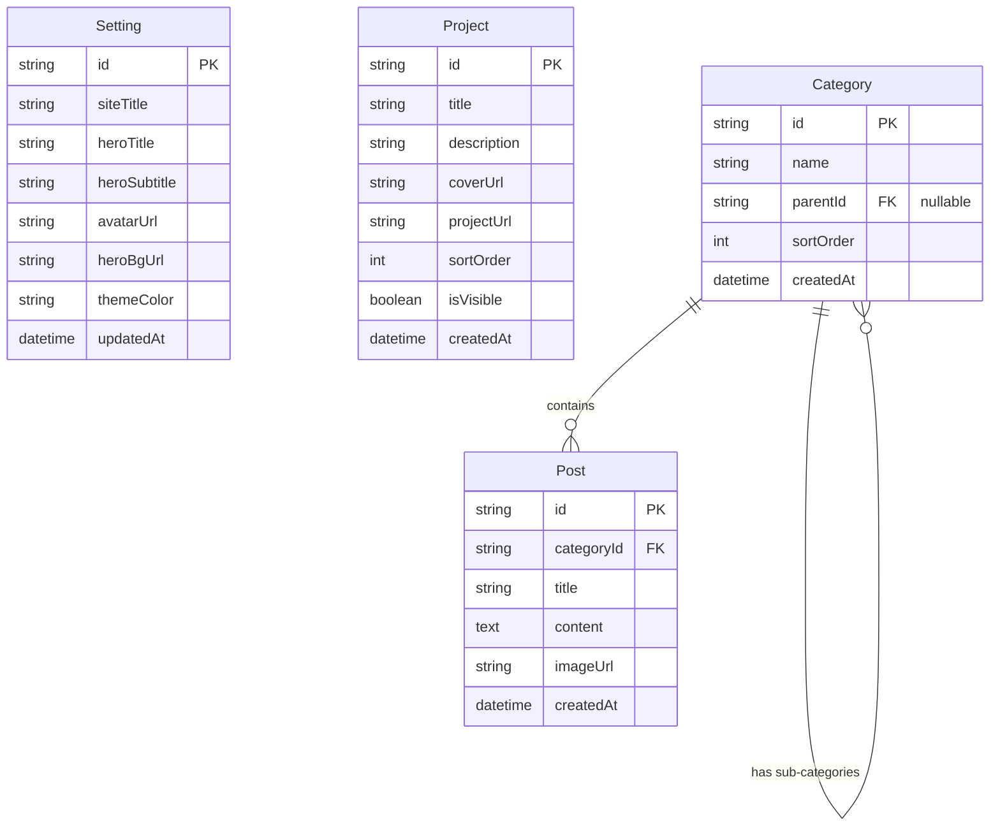

## 1. 架构设计

系统采用全栈 Next.js 架构，前端展示与后端 API 路由在同一代码库中同构开发，非常适合在 Vercel 上进行零配置部署。数据持久化依赖 Vercel Postgres（或兼容的 PostgreSQL），多媒体文件上传利用 Vercel Blob 进行对象存储。



## 2. 技术栈说明
- **核心框架**: Next.js 14 (App Router) + React 18
- **样式与UI**: Tailwind CSS 3 + Framer Motion (动画) + shadcn/ui (后台组件) + Lucide React (图标)
- **数据库与ORM**: Prisma + PostgreSQL (推荐使用 Vercel Postgres)
- **文件存储**: `@vercel/blob` 用于上传头像、壁纸、项目封面和图文配图。
- **身份验证**: NextAuth.js (用于保护 `/admin` 路由及相关 API)
- **部署平台**: Vercel

## 3. 路由定义
| 路由路径 | 渲染方式 | 页面用途 |
|-------|---------|---------|
| `/` | SSR / ISR | 前台首页，展示Hero区、项目及动态栏目内容 |
| `/project/[id]` | SSR | 单个项目详情或外部重定向中间页（如需） |
| `/admin/login` | CSR/SSR | 后台管理员登录页面 |
| `/admin` | SSR | 后台管理仪表盘主页 |
| `/admin/settings` | SSR/CSR | 基础设置（主题色、文字、头像、Hero壁纸） |
| `/admin/projects` | SSR/CSR | 项目展示管理（增删改查及链接编辑） |
| `/admin/categories` | SSR/CSR | 栏目及子栏目管理 |
| `/admin/posts` | SSR/CSR | 图文内容发布与管理 |

## 4. API 定义
通过 Next.js Route Handlers (`app/api/...`) 或 Server Actions 实现。

### 4.1 核心接口概览
- **`GET /api/settings`**: 获取全局配置信息（颜色、壁纸、文字）。
- **`PUT /api/settings`**: 更新全局配置。
- **`GET /api/projects`**: 获取项目列表。
- **`POST /api/projects`**: 新增项目。
- **`PUT /api/projects/:id`**: 更新单个项目（包含链接）。
- **`GET /api/categories`**: 获取嵌套栏目树。
- **`POST /api/upload`**: 接收文件流并上传至 Vercel Blob，返回 URL。

## 5. 数据模型设计 (Data Model)

### 5.1 数据模型定义 (ER 图)


### 5.2 数据定义语言 (Prisma Schema 示例)
```prisma
generator client {
  provider = "prisma-client-js"
}

datasource db {
  provider = "postgresql"
  url      = env("DATABASE_URL")
}

// 基础配置表 (通常只有一条记录)
model Setting {
  id           String   @id @default(cuid())
  siteTitle    String   @default("My Portfolio")
  heroTitle    String   @default("Hello, I'm a Creator")
  heroSubtitle String   @default("Welcome to my personal space")
  avatarUrl    String?
  heroBgUrl    String?
  themeColor   String   @default("#000000") // 默认主色调
  updatedAt    DateTime @updatedAt
}

// 项目展示表
model Project {
  id          String   @id @default(cuid())
  title       String
  description String?
  coverUrl    String?
  projectUrl  String   // 体验或跳转链接
  sortOrder   Int      @default(0)
  isVisible   Boolean  @default(true)
  createdAt   DateTime @default(now())
  updatedAt   DateTime @updatedAt
}

// 栏目表 (支持自关联实现子栏目)
model Category {
  id        String     @id @default(cuid())
  name      String
  parentId  String?
  parent    Category?  @relation("SubCategories", fields: [parentId], references: [id])
  children  Category[] @relation("SubCategories")
  posts     Post[]
  sortOrder Int        @default(0)
  createdAt DateTime   @default(now())
}

// 图文内容表
model Post {
  id         String   @id @default(cuid())
  categoryId String
  category   Category @relation(fields: [categoryId], references: [id])
  title      String
  content    String   @db.Text
  imageUrl   String?  // 题图或主要展示图
  createdAt  DateTime @default(now())
  updatedAt  DateTime @updatedAt
}
```